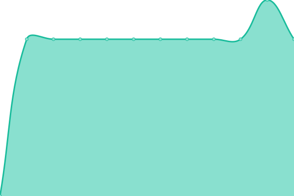

# [📈 Live Status](https://undefined.github.io/VISA): <!--live status--> **🟧 Partial outage**

This repository contains the open-source uptime monitor and status page for [undefined](https://undefined.github.io/VISA), powered by [Upptime](https://github.com/upptime/upptime).

With [Upptime](https://upptime.js.org), you can get your own unlimited and free uptime monitor and status page, powered entirely by a GitHub repository. We use [Issues](https://github.com/undefined/VISA/issues) as incident reports, [Actions](https://github.com/undefined/VISA/actions) as uptime monitors, and [Pages](https://undefined.github.io/VISA) for the status page.

<!--start: status pages-->
<!-- This summary is generated by Upptime (https://github.com/upptime/upptime) -->
<!-- Do not edit this manually, your changes will be overwritten -->
<!-- prettier-ignore -->
| URL | Status | History | Response Time | Uptime |
| --- | ------ | ------- | ------------- | ------ |
|  [ping_8.8.8.8](dns.google) | 🟩 Up | [ping-8-8-8-8.yml](https://github.com/YuriyDm123/VISA/commits/HEAD/history/ping-8-8-8-8.yml) | 

 5ms
     
 | 

<a href="https://YuriyDm123.github.io/VISA/history/ping-8-8-8-8">76.82%</a>
    

|  [198.241.150.240](3ds.visa.com) | 🟩 Up | [198-241-150-240.yml](https://github.com/YuriyDm123/VISA/commits/HEAD/history/198-241-150-240.yml) | 

 0ms
     
 | 

<a href="https://YuriyDm123.github.io/VISA/history/198-241-150-240">0.00%</a>
    

|  [198.241.184.92](3ds.visa.com) | 🟩 Up | [198-241-184-92.yml](https://github.com/YuriyDm123/VISA/commits/HEAD/history/198-241-184-92.yml) | 

 0ms
     
 | 

<a href="https://YuriyDm123.github.io/VISA/history/198-241-184-92">0.00%</a>
    

|  [198.217.243.16](3ds.visa.com) | 🟩 Up | [198-217-243-16.yml](https://github.com/YuriyDm123/VISA/commits/HEAD/history/198-217-243-16.yml) | 

 0ms
     
 | 

<a href="https://YuriyDm123.github.io/VISA/history/198-217-243-16">0.00%</a>
    

|  [198.241.150.240_KZ](3ds.visa.com) | 🟩 Up | [198-241-150-240-kz.yml](https://github.com/YuriyDm123/VISA/commits/HEAD/history/198-241-150-240-kz.yml) | 

 0ms
     
 | 

<a href="https://YuriyDm123.github.io/VISA/history/198-241-150-240-kz">100.00%</a>
    

|  [198.241.184.92_KZ](3ds.visa.com) | 🟩 Up | [198-241-184-92-kz.yml](https://github.com/YuriyDm123/VISA/commits/HEAD/history/198-241-184-92-kz.yml) | 

 0ms
     
 | 

<a href="https://YuriyDm123.github.io/VISA/history/198-241-184-92-kz">100.00%</a>
    

|  [198.217.243.16_KZ](3ds.visa.com) | 🟩 Up | [198-217-243-16-kz.yml](https://github.com/YuriyDm123/VISA/commits/HEAD/history/198-217-243-16-kz.yml) | 

 0ms
     
 | 

<a href="https://YuriyDm123.github.io/VISA/history/198-217-243-16-kz">100.00%</a>
    

|  [198.241.150.240_RU](3ds.visa.com) | 🟩 Up | [198-241-150-240-ru.yml](https://github.com/YuriyDm123/VISA/commits/HEAD/history/198-241-150-240-ru.yml) | 

 0ms
     
 | 

<a href="https://YuriyDm123.github.io/VISA/history/198-241-150-240-ru">100.00%</a>
    

|  [198.241.184.92_RU](3ds.visa.com) | 🟩 Up | [198-241-184-92-ru.yml](https://github.com/YuriyDm123/VISA/commits/HEAD/history/198-241-184-92-ru.yml) | 

 0ms
     
 | 

<a href="https://YuriyDm123.github.io/VISA/history/198-241-184-92-ru">100.00%</a>
    

|  [198.217.243.16_RU](3ds.visa.com) | 🟩 Up | [198-217-243-16-ru.yml](https://github.com/YuriyDm123/VISA/commits/HEAD/history/198-217-243-16-ru.yml) | 

 0ms
     
 | 

<a href="https://YuriyDm123.github.io/VISA/history/198-217-243-16-ru">100.00%</a>
    

|  [PING_43.159.113.78_KZ](safepass.unionpayintl.com) | 🟥 Down | [ping-43-159-113-78-kz.yml](https://github.com/YuriyDm123/VISA/commits/HEAD/history/ping-43-159-113-78-kz.yml) | 

 0ms
     
 | 

<a href="https://YuriyDm123.github.io/VISA/history/ping-43-159-113-78-kz">100.00%</a>
    

|  [PING_43.159.112.78_KZ](safepass.unionpayintl.com) | 🟥 Down | [ping-43-159-112-78-kz.yml](https://github.com/YuriyDm123/VISA/commits/HEAD/history/ping-43-159-112-78-kz.yml) | 

 0ms
     
 | 

<a href="https://YuriyDm123.github.io/VISA/history/ping-43-159-112-78-kz">100.00%</a>
    

|  [PING_43.159.113.78_RU](safepass.unionpayintl.com) | 🟩 Up | [ping-43-159-113-78-ru.yml](https://github.com/YuriyDm123/VISA/commits/HEAD/history/ping-43-159-113-78-ru.yml) | 

 0ms
     
 | 

<a href="https://YuriyDm123.github.io/VISA/history/ping-43-159-113-78-ru">100.00%</a>
    

|  [PING_43.159.112.78_RU](safepass.unionpayintl.com) | 🟩 Up | [ping-43-159-112-78-ru.yml](https://github.com/YuriyDm123/VISA/commits/HEAD/history/ping-43-159-112-78-ru.yml) | 

 0ms
     
 | 

<a href="https://YuriyDm123.github.io/VISA/history/ping-43-159-112-78-ru">100.00%</a>
    

<!--end: status pages-->

[**Visit our status website →**](https://undefined.github.io/VISA)

## 📄 License

- Powered by: [Upptime](https://github.com/upptime/upptime)
- Code: [MIT](./LICENSE) © [Anand Chowdhary](https://anandchowdhary.com), supported by [Pabio](https://pabio.com)
- Data in the `./history` directory: [Open Database License](https://opendatacommons.org/licenses/odbl/1-0/)
